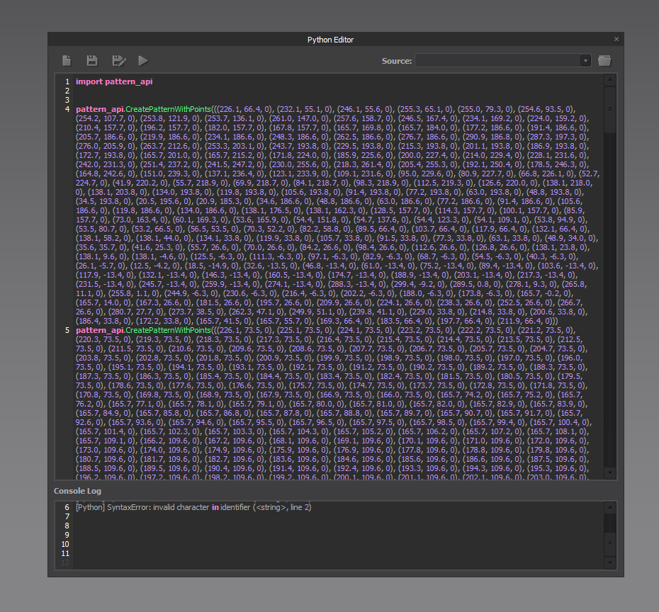

# Marvelous Designer用のスクリプト
BlenderのメッシュからMarvelous Designer用のパタ－ンを生成するスクリプト

## Blender側
・オブジェクトモードでも編集モードどっちでもok
・メッシュの頂点位置はZがゼロ(Marvelous Designerの2Dパターンになるため)で
・Bmeshの孤立したメッシュ(島)をパターンにします
・頂点は閉じていたほうが安牌
・メッシュは1mとか2mとか大きいほうがすんなり変換できると思います、あとはMarvelous Designer側でスケールしてください
・頂点が多いと時間がかかると思うので、適当に増減してください。

## マベ側
クリップボードに座標データをコピーするので、Marvelous DesignerのPythonコンソールに
ペーストして実行するとパターンが生成されます

